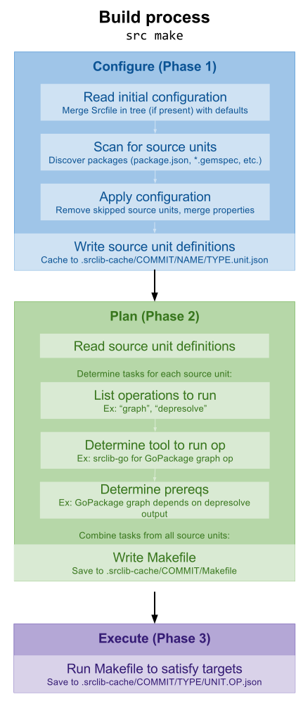

# `src make`

The `src make` command is the top-level task runner for the entire analysis
process. It should be run from the top-level source directory of a project. When
run, it determines the tasks that need to be run (based on manual configuration
and automatic detection and scanning) and then runs them.

When you run `src make` in a source directory, it executes tasks in 3 phases:

1. Configure
1. Plan
1. Execute




## Phase 1. Configure

First, `src config` configures the project by combining the Srcfile manual
configuration file (if present) and the list of source units produced by the
scanners it invokes.

1. Read the manual configuration in Srcfile, if present.
1. Determine which scanners to run, based on the list of default scanners and
   the Srcfile. (The config up to this point is called the **initial config**.)
1. Run each scanner to produce a list of discovered source units.
1. Merge the manually specified source units with the output from the scanners.
   (Manually specified source units take precedence.)
1. Eliminate source units that are skipped in the Srcfile.

The final product of the configuration phase is a JSON file representing each
source unit (Go type `unit.SourceUnit`) in the build cache.

After configuring a project that contains 2 source units whose names and types
are `NAME1`/`TYPE1` and `NAME2`/`TYPE2`, the build cache will contain the
following files:

* `.srclib-cache/COMMITID/NAME1/TYPE1.unit.v0.json`
* `.srclib-cache/COMMITID/NAME2/TYPE2.unit.v0.json`

TODO(sqs): make these files be generated themselves by a Makefile.config, so we
can regenerate them when the source unit definitions change.

## Phase 2. Plan

Next, `src plan` generates a Makefile that, when run, will run the necessary
commands to analyze the project. To do so, it examines each source unit (using
the build cache, if present) and generates rules for each of the predefined
operations (currently depresolve and graph).

To determine which tool to use for an operation on a source unit, TODO(sqs): how
does it know to run the Python grapher (and which Python grapher, if there are
multiple in the SRCLIBPATH) on pip package source units, for example?

Planning a project that contains a source units named `NAME1` of type `TYPE`
(and where `TOOLCHAIN` is the right toolchain to use) might yield the following
Makefile:

```
.srclib-cache/COMMITID/NAME1/TYPE1.graph.v0.json: .srclib-cache/COMMITID/NAME1/TYPE1.unit.v0.json
    src tool TOOLCHAIN graph # args vary

.srclib-cache/COMMITID/NAME1/TYPE1.depresolve.v0.json: .srclib-cache/COMMITID/NAME1/TYPE1.unit.v0.json
    src tool TOOLCHAIN depresolve # args vary
```

## Phase 3. Execute

Finally, `src make` executes the Makefile produced in the prior planning
phase.

The final products of the execution phase are the target JSON files containing
the results of executing the tools as specified in the Makefile.
